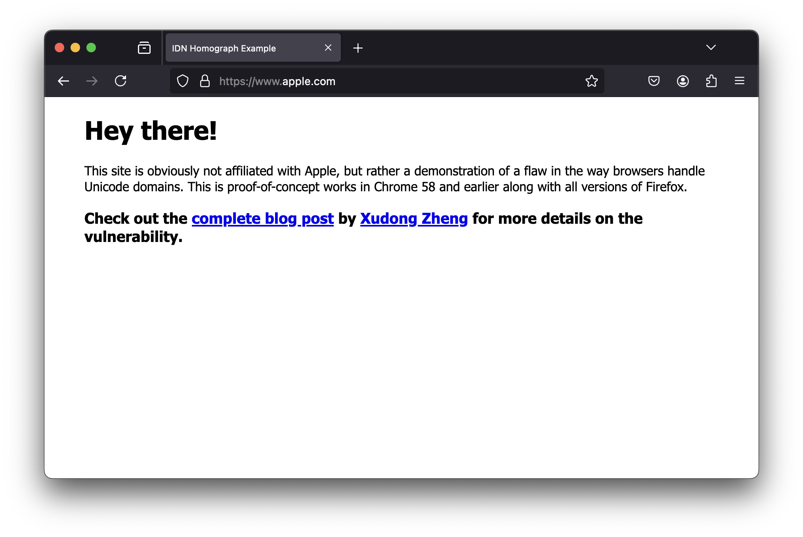

# PunycodeHunter

**PunycodeHunter** is an open-source tool designed to identify and report potential Punycode phishing domains that mimic well-known domain names. By generating visually similar domain names and converting them to Punycode, PunycodeHunter helps security analysts, IT professionals, and web administrators detect possible phishing threats before they become active.

## Background

In the realm of cybersecurity, IDN homograph attacks (also known as script spoofing) are a significant threat. These attacks utilize similar-looking characters from different scripts (e.g., Cyrillic, Greek, Latin) to create deceptive domain names that resemble trusted brands. For example, the domain `https://www.xn--80ak6aa92e.com/` appears as `apple.com` when Punycode is not displayed, thus potentially fooling users into thinking they are visiting the legitimate Apple website. PunycodeHunter was created to combat these types of threats by detecting such deceptive domains before they can be used in phishing attacks.


## Features

- **Domain Generation**: Automatically generates variations of a base domain using visually similar characters.
- **Punycode Conversion**: Converts Unicode domains to Punycode to easily identify potential phishing domains.
- **Availability Check**: Utilizes AWS Route 53 to check the availability of generated domains, providing insights into whether a domain might already be registered and potentially in use for malicious purposes.
- **Configurable**: Uses a YAML configuration file to easily adjust the set of characters used for generating domain variations.

## Installation

To install PunycodeHunter, follow these steps:

1. Clone the repository:
   ```bash
   git clone https://github.com/yourusername/PunycodeHunter.git
   cd PunycodeHunter
   ```

2. Install required dependencies:
   ```bash
   pip install -r requirements.txt
   ```

## Usage

To use PunycodeHunter, you need to set up the configuration file and run the main script.

1. **Edit the Configuration**:
    - Modify `similar_chars.yaml` to include the characters you want to consider for domain variations.

2. **Run the Tool**:
   ```bash
   python punycode_hunter.py
   ```

### Example

To generate domains similar to `example.com` and check their availability:

1. Update the `similar_chars.yaml` file with appropriate characters.
2. Run the script:
   ```bash
   python punycode_hunter.py
   ```

## Contributing

Contributions are welcome! Here are a few ways you can help improve PunycodeHunter:

- **Submit Bugs**: Report bugs on our GitHub issues page.
- **Feature Requests**: Have an idea for a new feature? Open an issue and tell us about it.
- **Pull Requests**: Submit pull requests with improvements or new features. Ensure your code follows the existing style and has sufficient test coverage.

Before contributing, please read the `CONTRIBUTING.md` document for details on how to submit patches and other contributions.

## License

PunycodeHunter is released under the MIT License. See the `LICENSE` file for more details.

## Support

If you have any questions or need help with configuration or usage, please open an issue on the GitHub repository, and we'll do our best to assist you.
